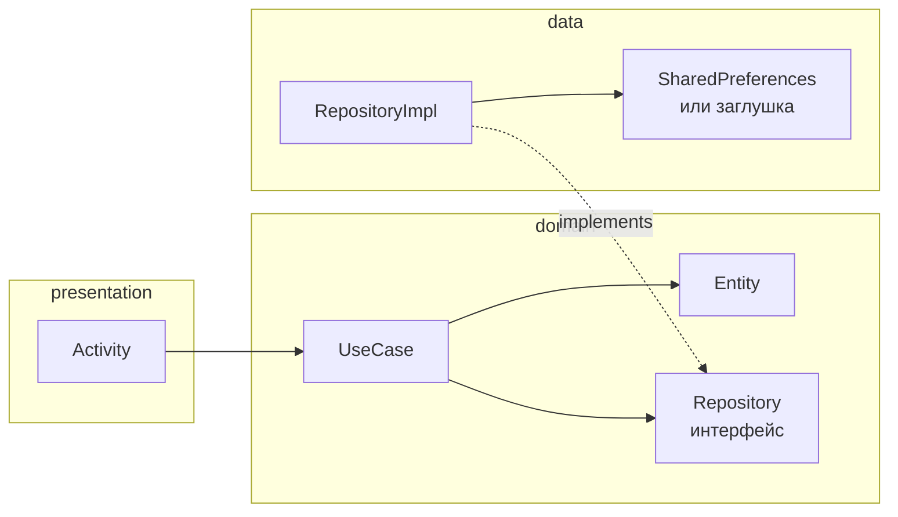
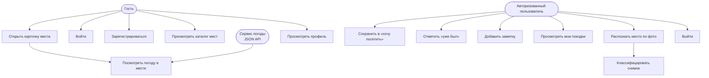
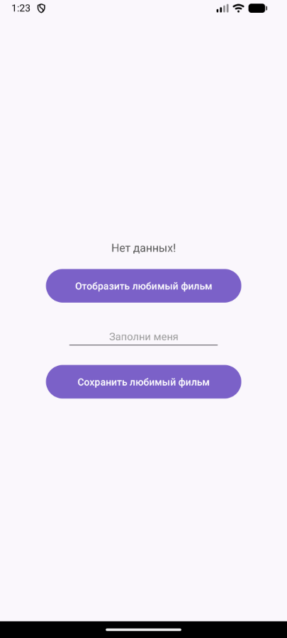
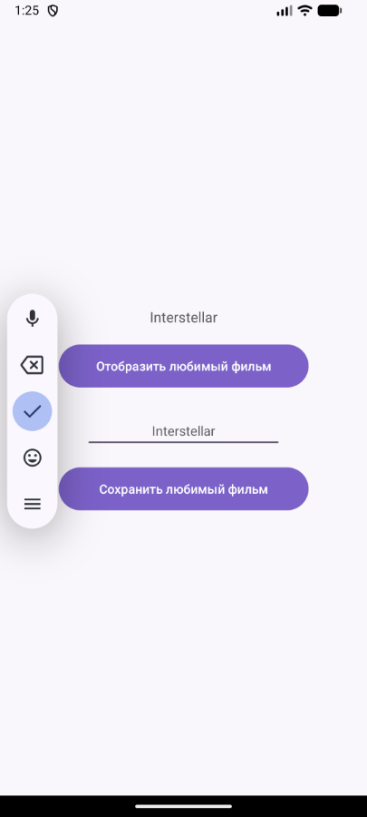
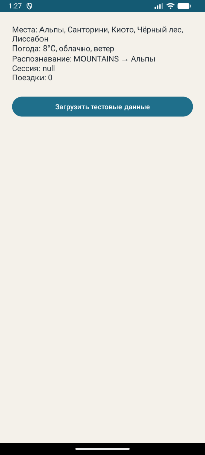

# Практическая работа № 1
### Clean Architecture в Android

Язык реализации — **Kotlin**

| | |
|---|---|
| Студент | Корнилов Кирилл Юрьевич БСБО-09-23 |
| Пакет MovieProject | `ru.mirea.kornilov.lesson9` |
| Пакет своего приложения | `ru.mirea.kornilov.sway` |

---

## Содержание

- [Что требовалось](#что-требовалось)
- [Слои](#слои)
- [1. Проектирование SWAY](#1-проектирование-sway)
- [2. MovieProject](#2-movieproject)
- [3. Болванка SWAY](#3-болванка-sway)
- [Соответствие методичке](#соответствие-методичке)

---

## Что требовалось

| § | Задание | Где в репозитории |
|---|---------|-------------------|
| 1.1 | Диаграмма use case своего приложения | [`SWAY/SWAY-use-case.drawio`](SWAY/SWAY-use-case.drawio) |
| 1.2 | Экраны и зоны ответственности слоёв | [`SWAY/SWAY-screens-layers.drawio`](SWAY/SWAY-screens-layers.drawio) |
| 2 | Учебный проект любимого фильма + SharedPreferences | [`MovieProject/`](MovieProject/) |
| 3 | Болванка своего приложения, use case + тестовые данные | [`SWAY/`](SWAY/) |

В своём приложении на курс заложены: авторизация, JSON API, БД, список с картинками, карточка сущности, гость ≠ пользователь, TensorFlow Lite. **На этой практике** это только диаграмма и каркас. Живые Retrofit / Room / `.tflite` — следующие занятия.

---

## Слои

Зависимости только **внутрь**. Экран вызывает use case, use case — интерфейс репозитория. Реализация и `Context` живут в `data`.



| Слой | Содержимое | Зависимости |
|------|------------|-------------|
| `presentation` | Activity, layout | только `domain` (+ `*Impl` создаётся здесь, как в методичке) |
| `domain` | Entity, UseCase, интерфейс Repository | ни от кого |
| `data` | `RepositoryImpl`, хранилище | `domain` |

---

## 1. Проектирование SWAY

**SWAY** — путеводитель по местам. Гость смотрит каталог и карточку. Пользователь сохраняет поездки и распознаёт тип места по фото.

Исходники диаграмм: draw.io. Ниже — та же схема, GitHub рисует её сам.

### Акторы и сценарии



Связи из UML-диаграммы:

- карточка **include** погоду;
- распознать **include** классификацию TFLite;
- хочу / был / заметка / выход — **extend**.

### Экраны

| Экран | Кто | Use case |
|-------|-----|----------|
| Вход / регистрация | все | `LoginUseCase`, `RegisterUseCase` |
| Каталог мест | все | `GetPlacesUseCase` |
| Карточка места | все; кнопки — после входа | `GetPlaceDetailsUseCase`, `GetWeatherUseCase`, поездки |
| Профиль | все, разное содержимое | `GetProfileUseCase`, `LogoutUseCase` |
| Мои поездки | пользователь | `GetMyTripsUseCase` |
| Распознать по фото | пользователь | `RecognizePlaceUseCase` |

Правило: экран ходит только в `domain`. `Context`, SharedPreferences, Room, Retrofit, TFLite — в `data`.

---

## 2. MovieProject

Учебный пример из §2. Пакет `ru.mirea.kornilov.lesson9`.

```
MovieProject/app/src/main/java/ru/mirea/kornilov/lesson9/
├── presentation/
│   └── MainActivity.kt
├── domain/
│   ├── models/Movie.kt
│   ├── repository/MovieRepository.kt
│   └── usecases/
│       ├── GetFavoriteFilmUseCase.kt
│       └── SaveMovieToFavoriteUseCase.kt
└── data/repository/
    └── MovieRepositoryImpl.kt
```

### Скриншоты

<p align="center">
  
  
  
</p>

<p align="center">
  <sub>Слева — старт («Нет данных!»). В центре — сохранение в SharedPreferences. Справа — чтение имени фильма.</sub>
</p>

### Layout

Идентификаторы как в методичке: `textViewMovie`, `buttonGetMovie`, `editTextMovie`, `buttonSaveMovie`.

```xml
<?xml version="1.0" encoding="utf-8"?>
<androidx.constraintlayout.widget.ConstraintLayout
    xmlns:android="http://schemas.android.com/apk/res/android"
    xmlns:app="http://schemas.android.com/apk/res-auto"
    android:layout_width="match_parent"
    android:layout_height="match_parent"
    android:background="@color/screen_background"
    android:paddingStart="32dp"
    android:paddingEnd="32dp">

    <TextView
        android:id="@+id/textViewMovie"
        android:layout_width="wrap_content"
        android:layout_height="wrap_content"
        android:text="@string/no_data"
        android:textColor="@color/text_primary"
        android:textSize="16sp"
        app:layout_constraintBottom_toTopOf="@id/buttonGetMovie"
        app:layout_constraintEnd_toEndOf="parent"
        app:layout_constraintStart_toStartOf="parent"
        app:layout_constraintTop_toTopOf="parent"
        app:layout_constraintVertical_chainStyle="packed" />

    <Button
        android:id="@+id/buttonGetMovie"
        android:layout_width="0dp"
        android:layout_height="48dp"
        android:layout_marginTop="20dp"
        android:background="@drawable/bg_purple_button"
        android:text="@string/show_favorite"
        android:textAllCaps="false"
        android:textColor="@android:color/white"
        app:backgroundTint="@null"
        app:layout_constraintBottom_toTopOf="@id/editTextMovie"
        app:layout_constraintEnd_toEndOf="parent"
        app:layout_constraintStart_toStartOf="parent"
        app:layout_constraintTop_toBottomOf="@id/textViewMovie"
        app:layout_constraintWidth_max="280dp" />

    <EditText
        android:id="@+id/editTextMovie"
        android:layout_width="0dp"
        android:layout_height="wrap_content"
        android:layout_marginTop="28dp"
        android:gravity="center"
        android:hint="@string/movie_hint"
        android:inputType="text"
        app:layout_constraintBottom_toTopOf="@id/buttonSaveMovie"
        app:layout_constraintEnd_toEndOf="parent"
        app:layout_constraintStart_toStartOf="parent"
        app:layout_constraintTop_toBottomOf="@id/buttonGetMovie"
        app:layout_constraintWidth_max="220dp" />

    <Button
        android:id="@+id/buttonSaveMovie"
        android:layout_width="0dp"
        android:layout_height="48dp"
        android:layout_marginTop="20dp"
        android:background="@drawable/bg_purple_button"
        android:text="@string/save_favorite"
        android:textAllCaps="false"
        android:textColor="@android:color/white"
        app:backgroundTint="@null"
        app:layout_constraintBottom_toBottomOf="parent"
        app:layout_constraintEnd_toEndOf="parent"
        app:layout_constraintStart_toStartOf="parent"
        app:layout_constraintTop_toBottomOf="@id/editTextMovie"
        app:layout_constraintWidth_max="280dp" />
</androidx.constraintlayout.widget.ConstraintLayout>
```

### Domain

Сущность и интерфейс репозитория — без Android API.

```kotlin
package ru.mirea.kornilov.lesson9.domain.models

data class Movie(
    val id: Int,
    val name: String
)
```

```kotlin
package ru.mirea.kornilov.lesson9.domain.repository

import ru.mirea.kornilov.lesson9.domain.models.Movie

interface MovieRepository {
    fun saveMovie(movie: Movie): Boolean
    fun getMovie(): Movie
}
```

Use case принимает репозиторий в конструкторе. Пустое имя не сохраняется.

```kotlin
package ru.mirea.kornilov.lesson9.domain.usecases

import ru.mirea.kornilov.lesson9.domain.models.Movie
import ru.mirea.kornilov.lesson9.domain.repository.MovieRepository

class SaveMovieToFavoriteUseCase(
    private val movieRepository: MovieRepository
) {
    fun execute(movie: Movie): Boolean {
        if (movie.name.isBlank()) {
            return false
        }
        return movieRepository.saveMovie(movie)
    }
}
```

```kotlin
package ru.mirea.kornilov.lesson9.domain.usecases

import ru.mirea.kornilov.lesson9.domain.models.Movie
import ru.mirea.kornilov.lesson9.domain.repository.MovieRepository

class GetFavoriteFilmUseCase(
    private val movieRepository: MovieRepository
) {
    fun execute(): Movie {
        return movieRepository.getMovie()
    }
}
```

### Data — SharedPreferences

`Context` только здесь. В domain его нет. Берётся `applicationContext`, чтобы не держать Activity.

```kotlin
package ru.mirea.kornilov.lesson9.data.repository

import android.content.Context
import ru.mirea.kornilov.lesson9.domain.models.Movie
import ru.mirea.kornilov.lesson9.domain.repository.MovieRepository

class MovieRepositoryImpl(context: Context) : MovieRepository {
    private val prefs = context.applicationContext
        .getSharedPreferences(PREFS_NAME, Context.MODE_PRIVATE)

    override fun saveMovie(movie: Movie): Boolean {
        return prefs.edit()
            .putInt(KEY_ID, movie.id)
            .putString(KEY_NAME, movie.name)
            .commit()
    }

    override fun getMovie(): Movie {
        val id = prefs.getInt(KEY_ID, -1)
        val name = prefs.getString(KEY_NAME, "").orEmpty()
        return Movie(id, name)
    }

    private companion object {
        const val PREFS_NAME = "favorite_movie"
        const val KEY_ID = "movie_id"
        const val KEY_NAME = "movie_name"
    }
}
```

### Presentation

Реализация репозитория создаётся в Activity и передаётся в use case — как в листинге методички (`new MovieRepositoryImpl(this)`).

```kotlin
package ru.mirea.kornilov.lesson9.presentation

import android.os.Bundle
import android.view.View
import android.widget.EditText
import android.widget.TextView
import androidx.appcompat.app.AppCompatActivity
import ru.mirea.kornilov.lesson9.R
import ru.mirea.kornilov.lesson9.data.repository.MovieRepositoryImpl
import ru.mirea.kornilov.lesson9.domain.models.Movie
import ru.mirea.kornilov.lesson9.domain.repository.MovieRepository
import ru.mirea.kornilov.lesson9.domain.usecases.GetFavoriteFilmUseCase
import ru.mirea.kornilov.lesson9.domain.usecases.SaveMovieToFavoriteUseCase

class MainActivity : AppCompatActivity() {
    override fun onCreate(savedInstanceState: Bundle?) {
        super.onCreate(savedInstanceState)
        setContentView(R.layout.activity_main)

        val text = findViewById<EditText>(R.id.editTextMovie)
        val textView = findViewById<TextView>(R.id.textViewMovie)
        val movieRepository: MovieRepository = MovieRepositoryImpl(this)

        findViewById<View>(R.id.buttonSaveMovie).setOnClickListener {
            val result = SaveMovieToFavoriteUseCase(movieRepository)
                .execute(Movie(2, text.text.toString()))
            textView.text = String.format("Save result %s", result)
        }

        findViewById<View>(R.id.buttonGetMovie).setOnClickListener {
            val movie = GetFavoriteFilmUseCase(movieRepository).execute()
            textView.text = if (movie.name.isEmpty()) {
                getString(R.string.no_data)
            } else {
                movie.name
            }
        }
    }
}
```

Пустое поле → `Save result false`. Имя сохранилось → `true`. «Отобразить» читает SharedPreferences; если пусто — снова «Нет данных!».

---

## 3. Болванка SWAY

Контрольное задание §3: Empty Views Activity, use case с этапа проектирования, репозитории отдают **тестовые данные**. Один экран.

```
SWAY/app/src/main/java/ru/mirea/kornilov/sway/
├── presentation/MainActivity.kt
├── domain/
│   ├── models/        Place, Weather, Trip, User, SceneType
│   ├── repository/    5 интерфейсов
│   └── usecases/      12 классов
└── data/repository/   5 *Impl
```

### Скриншот

<p align="center">
  
</p>

<p align="center">
  <sub>Кнопка вызывает use case. На экран попадают заглушки: места, погода, сцена <code>MOUNTAINS</code>.</sub>
</p>

### Use case’ы (как на диаграмме)

| Класс | Слой |
|-------|------|
| `LoginUseCase`, `RegisterUseCase`, `GetProfileUseCase`, `LogoutUseCase` | domain |
| `GetPlacesUseCase`, `GetPlaceDetailsUseCase` | domain |
| `GetWeatherUseCase` | domain |
| `SaveWantToVisitUseCase`, `MarkVisitedUseCase`, `AddPlaceNoteUseCase`, `GetMyTripsUseCase` | domain |
| `RecognizePlaceUseCase` | domain |
| `PlaceRepository`, `WeatherRepository`, `TripRepository`, `AuthRepository`, `RecognitionRepository` | domain (интерфейс) |
| `*Impl` | data |

### Entity и интерфейс

```kotlin
package ru.mirea.kornilov.sway.domain.models

data class Place(
    val id: Int,
    val name: String,
    val country: String,
    val description: String,
    val imageUrl: String,
    val sceneType: SceneType
)
```

```kotlin
package ru.mirea.kornilov.sway.domain.repository

import ru.mirea.kornilov.sway.domain.models.Place
import ru.mirea.kornilov.sway.domain.models.SceneType

interface PlaceRepository {
    fun getPlaces(): List<Place>
    fun getPlaceById(id: Int): Place?
    fun getPlacesByScene(sceneType: SceneType): List<Place>
}
```

```kotlin
package ru.mirea.kornilov.sway.domain.usecases

import ru.mirea.kornilov.sway.domain.models.Place
import ru.mirea.kornilov.sway.domain.repository.PlaceRepository

class GetPlacesUseCase(
    private val placeRepository: PlaceRepository
) {
    fun execute(): List<Place> {
        return placeRepository.getPlaces()
    }
}
```

Распознавание на этом этапе — заглушка: всегда горы, затем места с `SceneType.MOUNTAINS`.

```kotlin
package ru.mirea.kornilov.sway.domain.usecases

import ru.mirea.kornilov.sway.domain.models.Place
import ru.mirea.kornilov.sway.domain.models.SceneType
import ru.mirea.kornilov.sway.domain.repository.PlaceRepository
import ru.mirea.kornilov.sway.domain.repository.RecognitionRepository

class RecognizePlaceUseCase(
    private val recognitionRepository: RecognitionRepository,
    private val placeRepository: PlaceRepository
) {
    fun execute(): Pair<SceneType, List<Place>> {
        val scene = recognitionRepository.classifyScene()
        return scene to placeRepository.getPlacesByScene(scene)
    }
}
```

```kotlin
package ru.mirea.kornilov.sway.data.repository

import ru.mirea.kornilov.sway.domain.models.SceneType
import ru.mirea.kornilov.sway.domain.repository.RecognitionRepository

class RecognitionRepositoryImpl : RecognitionRepository {
    override fun classifyScene(): SceneType {
        return SceneType.MOUNTAINS
    }
}
```

### Тестовые данные в data

Пять мест (Альпы, Санторини, Киото, Чёрный лес, Лиссабон) и фейковая погода. `Context` не нужен.

```kotlin
class WeatherRepositoryImpl : WeatherRepository {
    private val weatherByPlace = mapOf(
        1 to Weather(1, 8, "облачно, ветер"),
        2 to Weather(2, 24, "ясно"),
        3 to Weather(3, 16, "небольшой дождь"),
        4 to Weather(4, 12, "туман"),
        5 to Weather(5, 21, "переменная облачность")
    )

    override fun getWeather(placeId: Int): Weather {
        return weatherByPlace[placeId] ?: Weather(placeId, 18, "нет данных")
    }
}
```

Полный список мест — [`PlaceRepositoryImpl.kt`](SWAY/app/src/main/java/ru/mirea/kornilov/sway/data/repository/PlaceRepositoryImpl.kt).

### MainActivity

Как в MovieProject: impl создаётся в Activity, в use case уходит интерфейс.

```kotlin
package ru.mirea.kornilov.sway.presentation

class MainActivity : AppCompatActivity() {
    override fun onCreate(savedInstanceState: Bundle?) {
        super.onCreate(savedInstanceState)
        setContentView(R.layout.activity_main)

        val textView = findViewById<TextView>(R.id.textViewStub)

        val placeRepository: PlaceRepository = PlaceRepositoryImpl()
        val weatherRepository: WeatherRepository = WeatherRepositoryImpl()
        val tripRepository: TripRepository = TripRepositoryImpl()
        val authRepository: AuthRepository = AuthRepositoryImpl()
        val recognitionRepository: RecognitionRepository = RecognitionRepositoryImpl()

        findViewById<View>(R.id.buttonLoadStub).setOnClickListener {
            val places = GetPlacesUseCase(placeRepository).execute()
            val weather = GetWeatherUseCase(weatherRepository).execute(places.first().id)
            val (scene, matched) = RecognizePlaceUseCase(
                recognitionRepository,
                placeRepository
            ).execute()
            textView.text = buildString {
                append("Места: ")
                append(places.joinToString { it.name })
                append("\nПогода: ${weather.temperatureC}°C, ${weather.description}")
                append("\nРаспознавание: $scene → ${matched.joinToString { it.name }}")
                append("\nСессия: ${authRepository.getCurrentUser()}")
                append("\nПоездки: ${tripRepository.getTrips().size}")
            }
        }
    }
}
```

```xml
<LinearLayout
    android:orientation="vertical"
    android:padding="24dp"
    ...>

    <TextView
        android:id="@+id/textViewStub"
        android:layout_width="match_parent"
        android:layout_height="wrap_content" />

    <Button
        android:id="@+id/buttonLoadStub"
        android:layout_width="match_parent"
        android:layout_height="wrap_content"
        android:text="@string/load_stub"
        android:textAllCaps="false" />
</LinearLayout>
```

---
