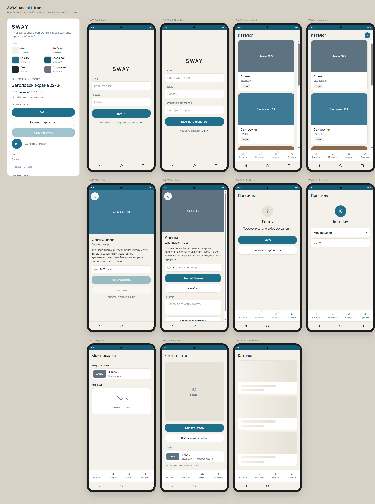
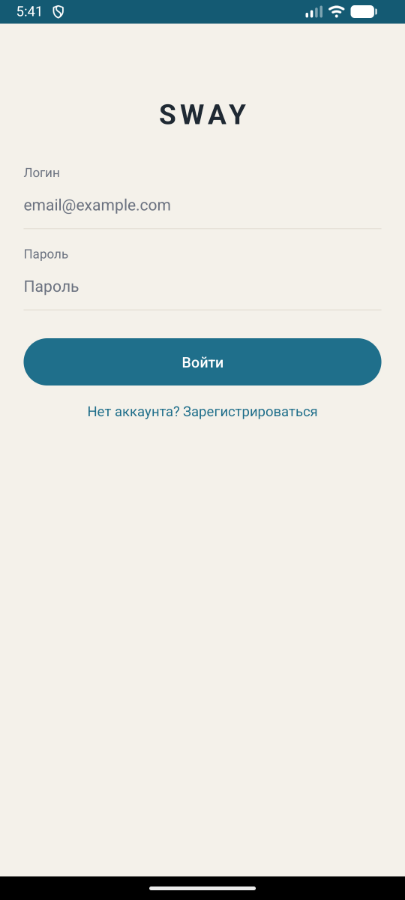
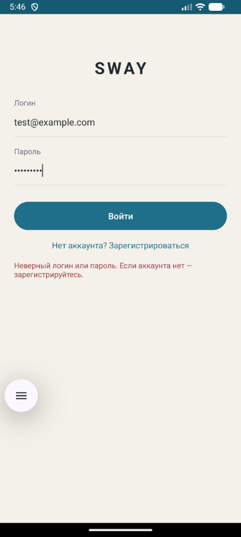
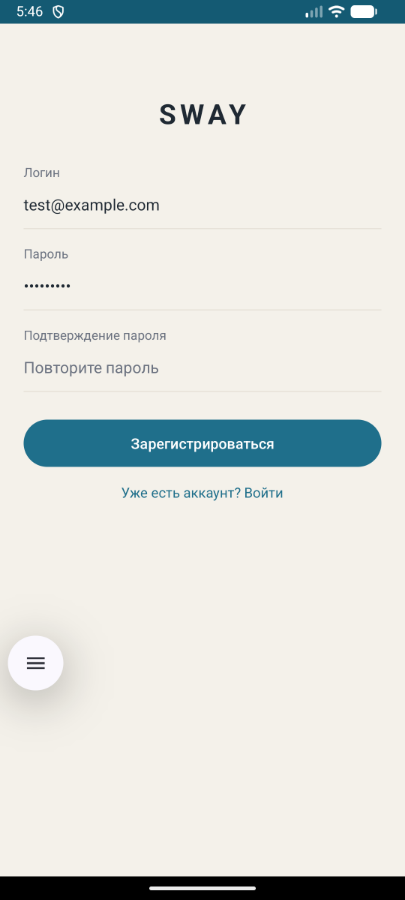

# Практическая работа № 2
### Модули, storage, Firebase Auth, три источника данных

Язык реализации — **Kotlin**

| | |
|---|---|
| Студент | Корнилов Кирилл Юрьевич БСБО-09-23 |
| Пакет MovieProject | `ru.mirea.kornilov.lesson9` |
| Пакет своего приложения | `ru.mirea.kornilov.sway` |

---

## Содержание

- [Что требовалось](#что-требовалось)
- [1. MovieProject: storage, модели, модули](#1-movieproject-storage-модели-модули)
- [2. Прототип SWAY](#2-прототип-sway)
- [3. Модули SWAY](#3-модули-sway)
- [4. Авторизация Firebase](#4-авторизация-firebase)
- [5. Три источника данных](#5-три-источника-данных)
- [Соответствие методичке](#соответствие-методичке)

---

## Что требовалось

| § | Задание | Где |
|---|---------|-----|
| Разбор | Вынести SharedPreferences из репозитория MovieProject в `MovieStorage` | [`MovieProject/data`](MovieProject/data) |
| Разбор | Отдельная модель в data + мапперы | `data/storage/models/Movie` |
| Разбор | Модули `app`, `data`, `domain` | [`MovieProject/settings.gradle`](MovieProject/settings.gradle) |
| Контрольное 1 | Прототип экранов | [SWAY — UI-кит (HTML)](SWAYDesign/sway-android-ui-kit.html) |
| Контрольное 2 | Модули `data` и `domain` у своего приложения | [`SWAY/`](SWAY/) |
| Контрольное 3 | Activity авторизации, Firebase на три модуля | `AuthActivity` + `AuthRepositoryImpl` |
| Контрольное 4 | SharedPreferences, Room, NetworkApi с моком | storage / db / network |

---

## 1. MovieProject: storage, модели, модули

Экран тот же, что на практике 1. Меняется сборка и то, кто пишет в SharedPreferences.

<p align="center">
  
</p>

<p align="center">
  <sub>UI не менялся. Сохранение по-прежнему через кнопку «Отобразить любимый фильм» после перезапуска.</sub>
</p>

### Модули

```
MovieProject/
├── app/       presentation, layout
├── domain/    Kotlin Library — без Android
└── data/      Android Library — storage + impl
```

```groovy
rootProject.name = "MovieProject"
include ':app'
include ':domain'
include ':data'
```

`app` зависит от `:domain` и `:data`. `data` зависит от `:domain`. В `domain` нет `Context` и SharedPreferences.

```groovy
dependencies {
    implementation project(':domain')
    implementation project(':data')
    implementation 'androidx.appcompat:appcompat:1.7.0'
    implementation 'com.google.android.material:material:1.12.0'
    implementation 'androidx.constraintlayout:constraintlayout:2.1.4'
}
```

### Storage

Репозиторий больше не знает про SharedPreferences. Интерфейс и реализация:

```kotlin
package ru.mirea.kornilov.lesson9.data.storage

import ru.mirea.kornilov.lesson9.data.storage.models.Movie

interface MovieStorage {
    fun get(): Movie
    fun save(movie: Movie): Boolean
}
```

Модель data-слоя **не** domain-`Movie`. Добавлено поле даты записи:

```kotlin
package ru.mirea.kornilov.lesson9.data.storage.models

data class Movie(
    val id: Int,
    val name: String,
    val localDate: String
)
```

```kotlin
package ru.mirea.kornilov.lesson9.data.storage.sharedprefs

class SharedPrefMovieStorage(context: Context) : MovieStorage {
    private val sharedPreferences = context.applicationContext
        .getSharedPreferences(SHARED_PREFS_NAME, Context.MODE_PRIVATE)

    override fun get(): Movie {
        val movieName = sharedPreferences.getString(KEY, "") ?: ""
        val movieDate = sharedPreferences.getString(DATE_KEY, LocalDate.now().toString())
            ?: LocalDate.now().toString()
        val movieId = sharedPreferences.getInt(ID_KEY, -1)
        return Movie(movieId, movieName, movieDate)
    }

    override fun save(movie: Movie): Boolean {
        return sharedPreferences.edit()
            .putString(KEY, movie.name)
            .putString(DATE_KEY, LocalDate.now().toString())
            .putInt(ID_KEY, movie.id)
            .commit()
    }
}
```

### Мапперы в репозитории

```kotlin
class MovieRepositoryImpl(
    private val movieStorage: MovieStorage
) : MovieRepository {

    override fun saveMovie(movie: DomainMovie): Boolean {
        return movieStorage.save(mapToStorage(movie))
    }

    override fun getMovie(): DomainMovie {
        return mapToDomain(movieStorage.get())
    }

    private fun mapToStorage(movie: DomainMovie): StorageMovie {
        return StorageMovie(
            id = 2,
            name = movie.name,
            localDate = LocalDate.now().toString()
        )
    }

    private fun mapToDomain(movie: StorageMovie): DomainMovie {
        return DomainMovie(id = movie.id, name = movie.name)
    }
}
```

### Activity

Как в методичке: storage создаётся с `this`, репозиторий получает storage.

```kotlin
val movieStorage: MovieStorage = SharedPrefMovieStorage(this)
val movieRepository: MovieRepository = MovieRepositoryImpl(movieStorage)
```

---

## 2. Прототип SWAY

HTML-макет (открывается в браузере):  
**[SWAY — UI-кит и экраны Android](SWAYDesign/sway-android-ui-kit.html)**

Файл: [`SWAYDesign/sway-android-ui-kit.html`](SWAYDesign/sway-android-ui-kit.html)

<p align="center">
  <a href="SWAYDesign/sway-android-ui-kit.html">
    
  </a>
</p>

<p align="center">
  <sub>Слева — палитра и компоненты. Справа — экраны: вход, регистрация, каталог (гость/пользователь), карточка, профиль, поездки, камера.</sub>
</p>

Цвета: фон `#F4F1EA`, primary `#1F6F8B`, текст `#1F2933`. Экран входа в приложении собран по этому макету (wordmark SWAY, поля, pill-кнопка).

---

## 3. Модули SWAY

```
SWAY/
├── app/       AuthActivity, MainActivity
├── domain/    entity, use case, интерфейсы репозиториев
└── data/      Firebase, SharedPreferences, Room, NetworkApi
```

```groovy
rootProject.name = "SWAY"
include ':app'
include ':domain'
include ':data'
```

`domain` — Kotlin Library, без Android и Firebase. `data` — Android Library.

---

## 4. Авторизация Firebase

Логика на три модуля:

| Слой | Что |
|------|-----|
| domain | `AuthRepository`, `LoginUseCase`, `RegisterUseCase` — без Firebase SDK |
| data | `AuthRepositoryImpl` + `FirebaseAuth` |
| app | `AuthActivity` |

### Скриншоты

<p align="center">
  
  
  
</p>

<p align="center">
  <sub>Слева — вход. В центре — неизвестный пользователь, красная подсказка. Справа — режим регистрации.</sub>
</p>

### Domain

```kotlin
interface AuthRepository {
    fun login(login: String, password: String, onResult: (Boolean) -> Unit)
    fun register(login: String, password: String, onResult: (Boolean) -> Unit)
    fun logout()
    fun getCurrentUser(): User?
}
```

```kotlin
class LoginUseCase(
    private val authRepository: AuthRepository
) {
    fun execute(login: String, password: String, onResult: (Boolean) -> Unit) {
        if (login.isBlank() || password.isBlank()) {
            onResult(false)
            return
        }
        authRepository.login(login.trim(), password, onResult)
    }
}
```

### Data — Firebase + SharedPreferences клиента

```kotlin
class AuthRepositoryImpl(
    private val clientStorage: ClientStorage
) : AuthRepository {
    private val firebaseAuth = FirebaseAuth.getInstance()

    override fun login(login: String, password: String, onResult: (Boolean) -> Unit) {
        firebaseAuth.signInWithEmailAndPassword(login, password)
            .addOnCompleteListener { task ->
                if (task.isSuccessful) {
                    clientStorage.saveLogin(login)
                    onResult(true)
                } else {
                    onResult(false)
                }
            }
    }
    // register — createUserWithEmailAndPassword, logout — signOut + clear prefs
}
```

Логин в Firebase — **email**, пароль от 6 символов. Конфиг: `SWAY/app/google-services.json`.

### Presentation

Стартовый экран — `AuthActivity`. После успеха открывается `MainActivity`.

Если вход не удался:

```xml
<string name="auth_error">Неверный логин или пароль. Если аккаунта нет — зарегистрируйтесь.</string>
```

Цвет ошибки `#9B3D3D`.

---

## 5. Три источника данных

| Источник | Класс | Что хранит |
|----------|--------|------------|
| SharedPreferences | `SharedPrefClientStorage` | логин клиента |
| Room | `SwayDatabase`, `TripDao`, `TripEntity` | поездки |
| NetworkApi | `MockNetworkApi` | места и погода (мок JSON) |

### SharedPreferences — клиент

```kotlin
class SharedPrefClientStorage(context: Context) : ClientStorage {
    private val prefs = context.applicationContext
        .getSharedPreferences("sway_client", Context.MODE_PRIVATE)

    override fun saveLogin(login: String) {
        prefs.edit().putString("client_login", login).apply()
    }
}
```

### Room — поездки

```kotlin
@Database(entities = [TripEntity::class], version = 1, exportSchema = false)
abstract class SwayDatabase : RoomDatabase() {
    abstract fun tripDao(): TripDao

    companion object {
        fun create(context: Context): SwayDatabase {
            return Room.databaseBuilder(
                context.applicationContext,
                SwayDatabase::class.java,
                "sway.db"
            ).allowMainThreadQueries().build()
        }
    }
}
```

Activity Room не видит: `TripRepositoryImpl.create(this)`.

### NetworkApi — мок

```kotlin
interface NetworkApi {
    fun getPlaces(): List<PlaceDto>
    fun getPlaceById(id: Int): PlaceDto?
    fun getWeather(placeId: Int): WeatherDto
}
```

`MockNetworkApi` отдаёт пять мест (Альпы, Санторини, Киото, Чёрный лес, Лиссабон) и погоду. Репозиторий мапит DTO в domain:

```kotlin
class PlaceRepositoryImpl(
    private val networkApi: NetworkApi
) : PlaceRepository {
    override fun getPlaces(): List<Place> {
        return networkApi.getPlaces().map { it.toDomain() }
    }
}
```

`MainActivity` после входа собирает три impl и по кнопке показывает, откуда данные:

```kotlin
val clientStorage = SharedPrefClientStorage(this)
val networkApi: NetworkApi = MockNetworkApi()
val placeRepository: PlaceRepository = PlaceRepositoryImpl(networkApi)
val weatherRepository: WeatherRepository = WeatherRepositoryImpl(networkApi)
val tripRepository: TripRepository = TripRepositoryImpl.create(this)
val authRepository: AuthRepository = AuthRepositoryImpl(clientStorage)
```

---
