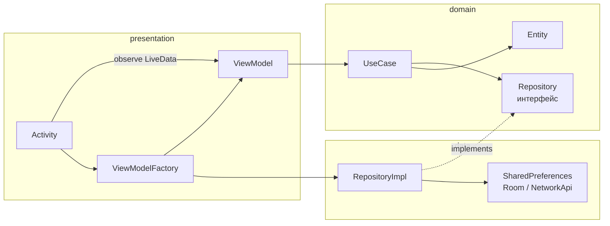
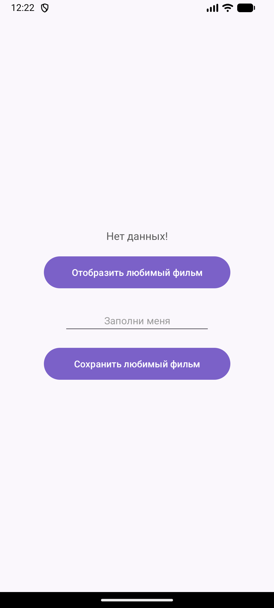
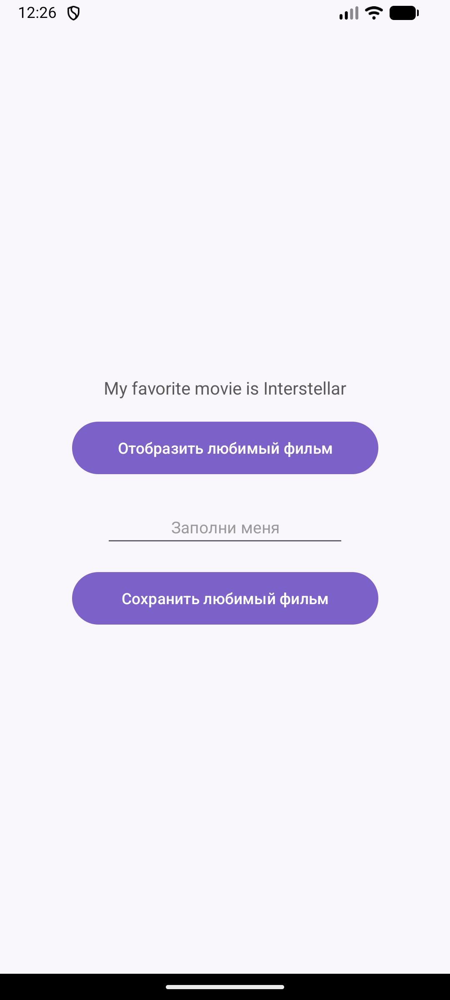
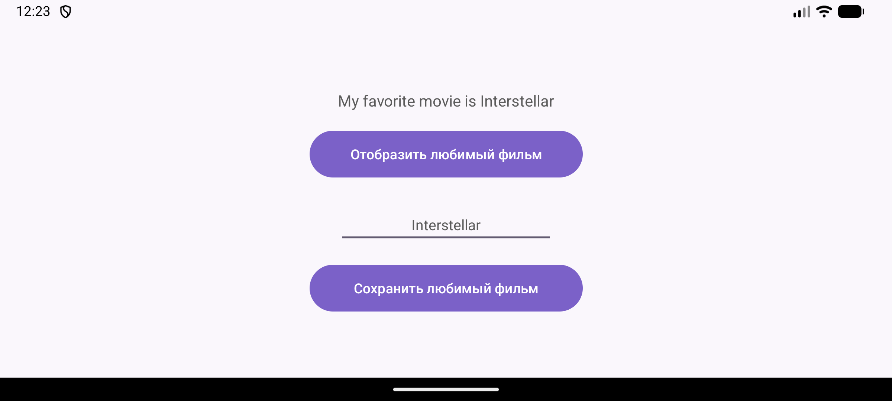
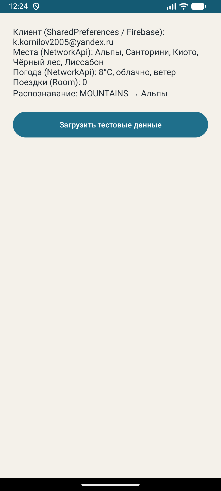
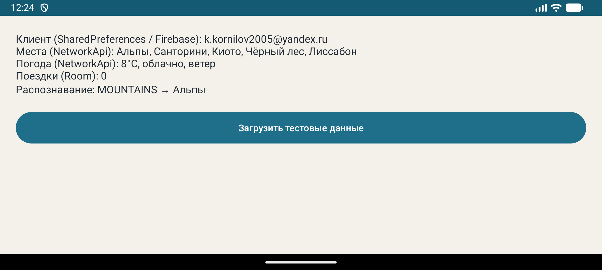

# Практическая работа № 3
### MVVM: ViewModel, LiveData, MediatorLiveData

Язык реализации — **Kotlin**

| | |
|---|---|
| Студент | Корнилов Кирилл Юрьевич БСБО-09-23 |
| Пакет MovieProject | `ru.mirea.kornilov.lesson9` |
| Пакет своего приложения | `ru.mirea.kornilov.sway` |

---

## Содержание

- [Что требовалось](#что-требовалось)
- [Слои после MVVM](#слои-после-mvvm)
- [1. MovieProject: ViewModel и LiveData](#1-movieproject-viewmodel-и-livedata)
- [2. SWAY: ViewModel на экранах](#2-sway-viewmodel-на-экранах)
- [3. MediatorLiveData: сеть и БД](#3-mediatorlivedata-сеть-и-бд)
- [Соответствие методичке](#соответствие-методичке)

---

## Что требовалось

| § | Задание | Где |
|---|---------|-----|
| Разбор | Открыть приложение из практики 1, вынести логику из Activity в ViewModel | [`MovieProject/app/.../presentation`](MovieProject/app/src/main/java/ru/mirea/kornilov/lesson9/presentation) |
| Разбор | `ViewModelProvider` + `ViewModelFactory`, без `View`/`Context` во ViewModel | `MainViewModel`, `ViewModelFactory` |
| Разбор | Обновление UI через LiveData | `MutableLiveData<String> favoriteMovie` |
| Контрольное 1 | Activity ходит в domain только через ViewModel | `AuthViewModel`, `MainViewModel` |
| Контрольное 2 | Состояние интерфейса через LiveData | observe в `AuthActivity` / `MainActivity` |
| Контрольное 3 | MediatorLiveData: мок-сеть + БД | `MainViewModel`: `networkLive` + `tripsLive` |

Семь функциональных требований из §3 методички (каталог с картинками, карточка, гость ≠ пользователь, TFLite) — это рамка **всего курса**. На этой практике — ViewModel и LiveData. Макеты экранов не менялись.

---

## Слои после MVVM

Зависимости только **внутрь**. Activity больше не вызывает use case. ViewModel не знает про Activity и не держит `View`/`Context`. Storage и Room собирает фабрика.



| Слой | Содержимое | Зависимости |
|------|------------|-------------|
| `presentation` | Activity, ViewModel, Factory, layout | `domain`; Factory создаёт `*Impl` |
| `domain` | Entity, UseCase, интерфейс Repository | ни от кого |
| `data` | `RepositoryImpl`, storage, Room, мок API | `domain` |

На схеме экранов SWAY ViewModel уже был: [`SWAY/SWAY-screens-layers.drawio`](SWAY/SWAY-screens-layers.drawio).

---

## 1. MovieProject: ViewModel и LiveData

Экран тот же. Меняется, **кто** вызывает use case и **как** текст попадает в `TextView`.

<p align="center">
  
  
</p>

<p align="center">
  <sub>Слева — старт, LiveData ещё пустая, в разметке «Нет данных!». Справа — после «Отобразить»: строка из LiveData.</sub>
</p>

### Зависимости

```groovy
implementation 'androidx.lifecycle:lifecycle-viewmodel-ktx:2.7.0'
implementation 'androidx.lifecycle:lifecycle-livedata-ktx:2.7.0'
```

### MainViewModel

Наследует `androidx.lifecycle.ViewModel`. Use case вызываются здесь. `setText` / `getText` ничего не возвращают — пишут в `MutableLiveData`.

```kotlin
class MainViewModel(
    private val movieRepository: MovieRepository
) : ViewModel() {

    private val favoriteMovie = MutableLiveData<String>()

    init {
        Log.d(MainViewModel::class.java.simpleName, "MainViewModel created")
    }

    fun getFavoriteMovie(): MutableLiveData<String> = favoriteMovie

    fun setText(movie: Movie) {
        val result = SaveMovieToFavoriteUseCase(movieRepository).execute(movie)
        favoriteMovie.value = result.toString()
    }

    fun getText() {
        val movie = GetFavoriteFilmUseCase(movieRepository).execute()
        favoriteMovie.value = if (movie.name.isEmpty()) {
            "Нет данных!"
        } else {
            String.format("My favorite movie is %s", movie.name)
        }
    }

    override fun onCleared() {
        Log.d(MainViewModel::class.java.simpleName, "MainViewModel cleared")
        super.onCleared()
    }
}
```

`SharedPrefMovieStorage` нужен `Context`. Его во ViewModel нет: репозиторий приходит из конструктора.

### ViewModelFactory

Как в методичке: фабрика знает `Context`, собирает storage и repository.

```kotlin
class ViewModelFactory(
    context: Context
) : ViewModelProvider.Factory {
    private val context = context.applicationContext

    @Suppress("UNCHECKED_CAST")
    override fun <T : ViewModel> create(modelClass: Class<T>): T {
        val sharedPrefMovieStorage: MovieStorage = SharedPrefMovieStorage(context)
        val movieRepository: MovieRepository = MovieRepositoryImpl(sharedPrefMovieStorage)
        return MainViewModel(movieRepository) as T
    }
}
```

### Activity

`AppCompatActivity` — это `ViewModelStoreOwner`. Не `new MainViewModel()`: тогда при повороте ViewModel тоже умрёт.

```kotlin
val vm = ViewModelProvider(this, ViewModelFactory(this))[MainViewModel::class.java]

vm.getFavoriteMovie().observe(this) { value ->
    textView.text = value
}

findViewById<View>(R.id.buttonSaveMovie).setOnClickListener {
    vm.setText(Movie(2, text.text.toString()))
}
findViewById<View>(R.id.buttonGetMovie).setOnClickListener {
    vm.getText()
}
```

### Поворот экрана

После «Отобразить» поворот не сбрасывает надпись: LiveData отдаёт последнее значение новой Activity.

<p align="center">
  
</p>

<p align="center">
  <sub>Альбомная ориентация: «My favorite movie is Interstellar» на месте.</sub>
</p>

Logcat (фильтр `MainActivity|MainViewModel`):

| Действие | Что в logcat |
|----------|----------------|
| Первый запуск | `MainViewModel created`, `MainActivity created` |
| Поворот | только `MainActivity created` |
| Закрыли приложение | `MainViewModel cleared` |

Если писать `vm = MainViewModel(...)` без Provider, при повороте будет второй `MainViewModel created`.

---

## 2. SWAY: ViewModel на экранах

Макеты те же, что на практике 2. Activity больше не создаёт repository и не вызывает use case.

### AuthViewModel

Режим регистрации, ошибка и «уже вошли» — LiveData. Firebase-колбэк пишет через `postValue`.

```kotlin
class AuthViewModel(
    private val authRepository: AuthRepository
) : ViewModel() {

    private val registerMode = MutableLiveData(false)
    private val statusRes = MutableLiveData<Int?>(null)
    private val loggedIn = MutableLiveData(false)

    fun toggleMode() {
        registerMode.value = !(registerMode.value ?: false)
        statusRes.value = null
    }

    fun submit(login: String, password: String, confirm: String) {
        val onResult: (Boolean) -> Unit = { ok ->
            if (ok) loggedIn.postValue(true)
            else statusRes.postValue(R.string.auth_error)
        }
        if (registerMode.value == true) {
            if (password != confirm) {
                statusRes.value = R.string.passwords_mismatch
                return
            }
            RegisterUseCase(authRepository).execute(login, password, onResult)
        } else {
            LoginUseCase(authRepository).execute(login, password, onResult)
        }
    }
}
```

Если `GetProfileUseCase` уже видит пользователя, `loggedIn = true` — Activity сразу открывает главный экран.

### AuthActivity

Только поля, кнопки и `observe`. Поворот в режиме регистрации оставляет блок подтверждения пароля: `registerMode` живёт во ViewModel.

```kotlin
val vm = ViewModelProvider(this, ViewModelFactory(this))[AuthViewModel::class.java]

vm.getLoggedIn().observe(this) { loggedIn ->
    if (loggedIn) openMain()
}
vm.getRegisterMode().observe(this) { registerMode ->
    confirmBlock.visibility = if (registerMode) View.VISIBLE else View.GONE
    submit.setText(if (registerMode) R.string.sign_up else R.string.sign_in)
    switchMode.setText(if (registerMode) R.string.to_login else R.string.to_register)
}
vm.getStatusRes().observe(this) { resId ->
    status.text = if (resId == null) "" else getString(resId)
}
```

<p align="center">
  
  
  
</p>

<p align="center">
  <sub>UI входа не менялся. Слой — ViewModel. Ошибка по-прежнему красным `#9B3D3D`.</sub>
</p>

### Фабрика SWAY

Один `ViewModelFactory` на оба экрана. `Context`, Firebase и Room остаются здесь, не во ViewModel.

```kotlin
if (modelClass.isAssignableFrom(AuthViewModel::class.java)) {
    return AuthViewModel(authRepository) as T
}
if (modelClass.isAssignableFrom(MainViewModel::class.java)) {
    val networkApi: NetworkApi = MockNetworkApi()
    val placeRepository: PlaceRepository = PlaceRepositoryImpl(networkApi)
    val weatherRepository: WeatherRepository = WeatherRepositoryImpl(networkApi)
    val tripRepository: TripRepository = TripRepositoryImpl.create(context)
    val recognitionRepository: RecognitionRepository = RecognitionRepositoryImpl()
    return MainViewModel(
        authRepository,
        placeRepository,
        weatherRepository,
        tripRepository,
        recognitionRepository
    ) as T
}
```

---

## 3. MediatorLiveData: сеть и БД

Контрольный пункт: свести замоканную сеть и Room. Во `MainViewModel` два источника:

| LiveData | Откуда | Что |
|----------|--------|-----|
| `networkLive` | `MockNetworkApi` через use case | профиль, места, погода, распознавание |
| `tripsLive` | Room через `GetMyTripsUseCase` | поездки |

`MediatorLiveData<String> summary` подписан на оба. Текст на экране появляется, только когда пришли **и** сеть, **и** БД.

```kotlin
private val networkLive = MutableLiveData<NetworkSnapshot>()
private val tripsLive = MutableLiveData<List<Trip>>()
private val summary = MediatorLiveData<String>()

init {
    summary.addSource(networkLive) { merge() }
    summary.addSource(tripsLive) { merge() }
}

fun loadStub() {
    // use case мест / погоды / профиля / распознавания → networkLive
    tripsLive.value = GetMyTripsUseCase(tripRepository).execute()
}

private fun merge() {
    val network = networkLive.value ?: return
    val trips = tripsLive.value ?: return
    summary.value = buildString {
        append("Клиент (SharedPreferences / Firebase): ${network.login}")
        append("\nМеста (NetworkApi): ${network.places.joinToString { it.name }}")
        append("\nПогода (NetworkApi): ...")
        append("\nПоездки (Room): ${trips.size}")
        append("\nРаспознавание: ${network.scene} → ...")
    }
}
```

`MainActivity` только подписывается:

```kotlin
val vm = ViewModelProvider(this, ViewModelFactory(this))[MainViewModel::class.java]

vm.getSummary().observe(this) { value ->
    textView.text = value
}
findViewById<View>(R.id.buttonLoadStub).setOnClickListener {
    vm.loadStub()
}
```

<p align="center">
  
  
</p>

<p align="center">
  <sub>Слева — после кнопки: места и погода из мока, поездки из Room. Справа — поворот, текст на месте.</sub>
</p>

---

## Соответствие методичке

| Методичка | Сделано |
|-----------|---------|
| MVVM в слое app | Activity = UI, ViewModel = логика |
| `MainViewModel extends ViewModel` | MovieProject и SWAY |
| Не держать View/Context во ViewModel | repository из Factory |
| `ViewModelProvider` + Factory | оба проекта |
| LiveData, Activity observe | `favoriteMovie`, `loggedIn`, `summary` |
| Поворот не теряет состояние | скрины landscape |
| Activity → domain только через ViewModel | SWAY Auth/Main |
| MediatorLiveData, мок-сеть + БД | `networkLive` + `tripsLive` |

Каталог с картинками, карточка места, роли гостя и живой TensorFlow Lite — следующие практики.
