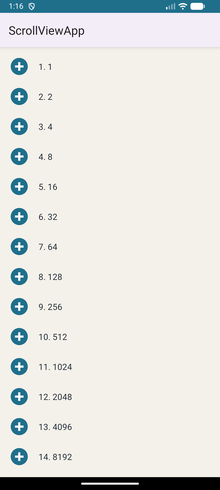
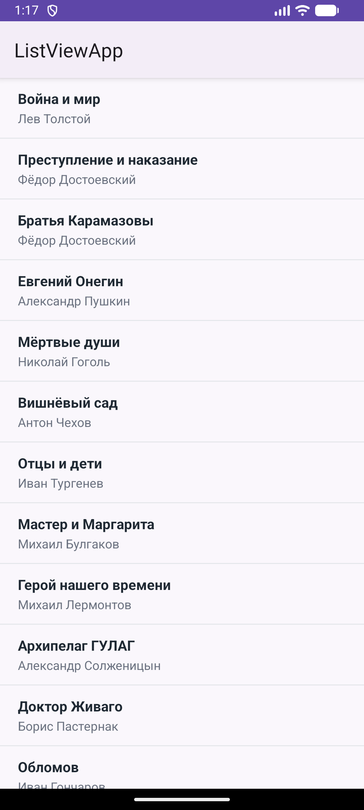
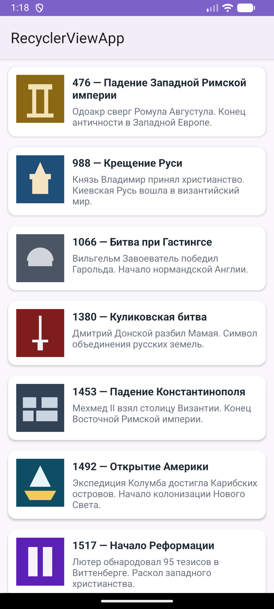
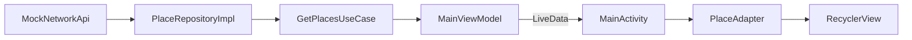
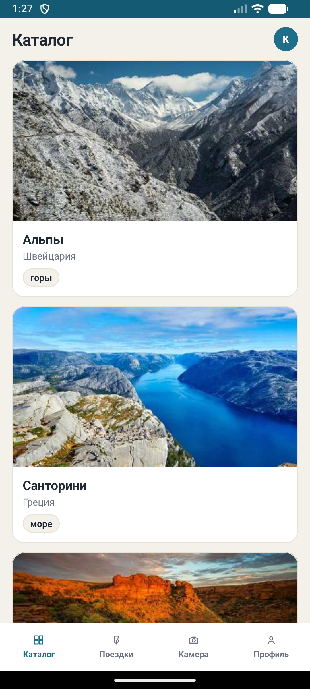

# Практическая работа № 4
### Списки: ScrollView, ListView, RecyclerView

Язык реализации — **Kotlin**

| | |
|---|---|
| Студент | Корнилов Кирилл Юрьевич БСБО-09-23 |
| Учебные модули | [`Practice4/`](Practice4/) |
| Пакет своего приложения | `ru.mirea.kornilov.sway` |

---

## Содержание

- [Что требовалось](#что-требовалось)
- [1. ScrollViewApp](#1-scrollviewapp)
- [2. ListViewApp](#2-listviewapp)
- [3. RecyclerViewApp](#3-recyclerviewapp)
- [4. SWAY: каталог в RecyclerView](#4-sway-каталог-в-recyclerview)
- [Соответствие методичке](#соответствие-методичке)

---

## Что требовалось

| § | Задание | Где |
|---|---------|-----|
| 1.1 | Модуль `ScrollViewApp`: геометрическая прогрессия со знаменателем 2, 100 элементов, скрин | [`Practice4/ScrollViewApp`](Practice4/ScrollViewApp) |
| 1.2 | Модуль `ListViewApp`: авторы и книги на 30 лет, больше 30 пунктов, скрин | [`Practice4/ListViewApp`](Practice4/ListViewApp) |
| 1.3 | Список исторических событий с описанием и картинкой, скрин | [`Practice4/RecyclerViewApp`](Practice4/RecyclerViewApp) |
| Контрольное | Своё приложение: заглушка в репозитории → LiveData → RecyclerView | [`SWAY/`](SWAY/) |

Три учебных приложения — модули одного проекта:

```
Practice4/
├── ScrollViewApp/      application
├── ListViewApp/        application
└── RecyclerViewApp/    application
```

```groovy
rootProject.name = "Practice4"
include ':ScrollViewApp'
include ':ListViewApp'
include ':RecyclerViewApp'
```

---

## 1. ScrollViewApp

Пакет `ru.mirea.kornilov.scrollviewapp`. Разметка элемента `item.xml`: иконка + текст. На экране `ScrollView` → `LinearLayout` (`wrapper`). 100 строк через `LayoutInflater`.

Первый член 1, знаменатель 2: \(1, 2, 4, \ldots, 2^{99}\). Числа больше `Long` — `BigInteger`.

```kotlin
val wrapper = findViewById<LinearLayout>(R.id.wrapper)
var term = BigInteger.ONE
for (i in 1..100) {
    val view = layoutInflater.inflate(R.layout.item, wrapper, false)
    val text = view.findViewById<TextView>(R.id.textView)
    text.text = String.format("%d. %s", i, term.toString())
    wrapper.addView(view)
    term = term.multiply(BigInteger.TWO)
}
```

<p align="center">
  
</p>

<p align="center">
  <sub>Список длиннее экрана, прокручивается. На скрине начало: 1…8192.</sub>
</p>

---

## 2. ListViewApp

Пакет `ru.mirea.kornilov.listviewapp`. `ListView` + свой `ArrayAdapter`. **36** книг: название и автор.

```kotlin
class BookAdapter(
    context: Context,
    books: List<Book>
) : ArrayAdapter<Book>(context, 0, books) {

    override fun getView(position: Int, convertView: View?, parent: ViewGroup): View {
        val view = convertView ?: LayoutInflater.from(context)
            .inflate(R.layout.item_book, parent, false)
        val holder = view.tag as? ViewHolder ?: ViewHolder(view).also { view.tag = it }
        val book = getItem(position) ?: return view
        holder.title.text = book.title
        holder.author.text = book.author
        return view
    }
}
```

`ViewHolder` в `tag`, чтобы не искать `TextView` на каждом скролле.

<p align="center">
  
</p>

<p align="center">
  <sub>Две строки в пункте: книга жирным, автор серым. Больше 30 записей.</sub>
</p>

---

## 3. RecyclerViewApp

Пакет `ru.mirea.kornilov.recyclerviewapp`. **15** событий (от падения Рима до Берлинской стены): векторная иконка, заголовок, краткое описание. Карточка — `CardView`.

Как в разборе методички: модель `HistoryEvent` → `EventViewHolder` → `EventAdapter` → `LinearLayoutManager`.

```kotlin
class EventAdapter(
    private val events: List<HistoryEvent>
) : RecyclerView.Adapter<EventViewHolder>() {

    override fun onCreateViewHolder(parent: ViewGroup, viewType: Int): EventViewHolder {
        val view = LayoutInflater.from(parent.context)
            .inflate(R.layout.item_event, parent, false)
        return EventViewHolder(view)
    }

    override fun onBindViewHolder(holder: EventViewHolder, position: Int) {
        holder.bind(events[position])
    }

    override fun getItemCount(): Int = events.size
}
```

В Activity:

```kotlin
recyclerView.layoutManager = LinearLayoutManager(this)
recyclerView.adapter = EventAdapter(events())
```

<p align="center">
  
</p>

<p align="center">
  <sub>Карточка: картинка + год и название + описание.</sub>
</p>

---

## 4. SWAY: каталог в RecyclerView

Контрольное: заглушка в репозитории, LiveData, список на экране.



Заглушка — `MockNetworkApi`: восемь мест (Альпы, Санторини, Киото, Чёрный лес, Лиссабон, Каппадокия, Байкал, Рейкьявик) — название, страна, описание, `imageUrl`, тип сцены. `PlaceRepositoryImpl` мапит DTO в domain. `ViewModelFactory` собирает мок и репозиторий, во ViewModel `Context` нет.

```kotlin
class MainViewModel(
    private val placeRepository: PlaceRepository,
    private val authRepository: AuthRepository
) : ViewModel() {

    private val places = MutableLiveData<List<Place>>()
    private val avatarLetter = MutableLiveData("?")

    init {
        places.value = GetPlacesUseCase(placeRepository).execute()
        val login = GetProfileUseCase(authRepository).execute()?.login
        avatarLetter.value = login?.firstOrNull()?.uppercaseChar()?.toString() ?: "?"
    }

    fun getPlaces(): LiveData<List<Place>> = places
    fun getAvatarLetter(): LiveData<String> = avatarLetter
}
```

Activity только подписывается:

```kotlin
val adapter = PlaceAdapter()
recyclerView.layoutManager = LinearLayoutManager(this)
recyclerView.adapter = adapter

vm.getPlaces().observe(this) { places ->
    adapter.setItems(places)
}
vm.getAvatarLetter().observe(this) { letter ->
    findViewById<TextView>(R.id.textAvatar).text = letter
}
```

Фото грузит Coil из `imageUrl`. Карточка как в [UI-ките](SWAYDesign/sway-android-ui-kit.html): фото 16:9, название, страна, чип сцены (горы / море / город / лес). Шапка «Каталог», аватар с буквой логина, таббар (Каталог активен).

Авторизация с практики 3 не менялась. Табы Поездки / Камера / Профиль **не открывают экраны** — только разметка из макета.

<p align="center">
  
</p>

<p align="center">
  <sub>После входа — каталог. Данные из мока через LiveData.</sub>
</p>

---

